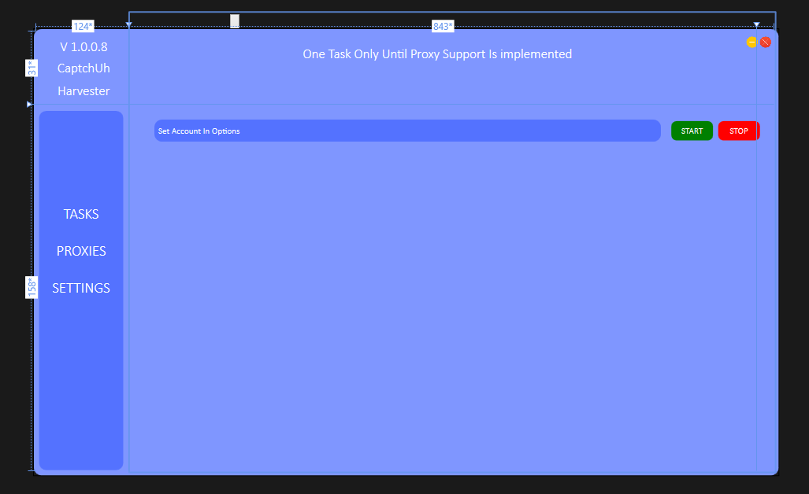

    
  <h3 align="center">CaptchUh</h3>

  

    A project aimed at countering reCaptcha for Google accounts.
     
    
This project is currently closed. 💀 RIP 2018 💀

  

## About The Project

In 2019, I was approached by my friends to assist in managing the overwhelming number of captcha verifications they were required to complete when purchasing online items. In order to fix this I had created CaptchUh, a tool to automate the actions of a human on a google account for captcha to be shown less often. This was my first larger project, that had about 50 people in the userbase.

### Technologies Utilized

I learned alot from this project, this was my first time learning WPF, PHP, and MySQL. It was extremely intresting learning about how to create a modern GUI with WPF, and how PHP could be used to interact with the MySQL database from adding users and checking valid credentials in the actual application. This also had made me realize how difficult it is to protect an application from being reverse engineered. Although my code had been obfuscated, the network traffic was not. It would be extremely easy for someone to capture the network traffic and change the return value to true, allowing them to bypass the login screen.

## Are You a Robot?

Google captcha is a security feature designed to differentiate between humans and bots, typically by presenting challenges that are easy for humans to solve but difficult for machines. But, to battle this it is important to understand how it decides who to ask for a captcha. Gmail accounts are given a certain "human score". This can be tested on a website such as [here](https://antcpt.com/eng/information/demo-form/recaptcha-3-test-score.html). It explains that there is a score between 0 and 1, where 1 is most likely human and 0 is most likely a bot. This score is determined by the following factors:

* How long the user has had the account
* How much activity the user has had on the account

## How CaptchUh Improves the Human Score

CaptchUh can boost the human score of a selected Google account. It achieves this by making random searches and watching YouTube videos, which mimics the behavior of a real human user. By doing so, the account becomes more trustworthy in the eyes of Google's algorithm, resulting in fewer captcha verifications and a smoother purchasing experience.
